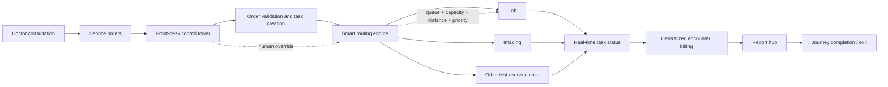
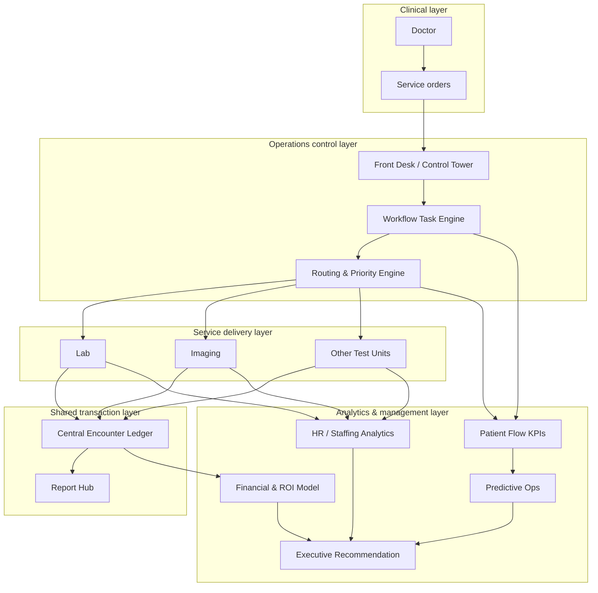

<div align="center">

# 🏥 BD Patient Journey Analytics

### Smart hospital flow from doctor decision to testing, payment, reporting and operational insight

[](ROADMAP.md)
[](DATA_PROVENANCE.md)
[](#-the-operating-problem)
[](#-analytics-workstreams)
[](LICENSE)

**Bangladesh National Medical City (BNMC) — synthetic operational case study**

Healthcare Operations · Workflow Automation · HR Operations / HRBP · Finance · Data Analytics

</div>

<p align="center">
  
</p>

---

## 🎯 The operating problem

A hospital visit can become unnecessarily difficult **after the doctor has already made the clinical decision**.

A patient may receive several test or service orders, then have to work out:

- which desk should accept the orders;
- which lab, imaging room or service unit should be visited first;
- whether another floor or building has a shorter queue;
- where each payment must be made;
- how to track unfinished tests;
- where the final reports will be collected; and
- who should intervene when capacity, staffing or routing changes.

This project models a different operating design: the **doctor remains responsible for clinical decisions**, while downstream execution is converted into a coordinated operational workflow.

> **Decision question:** should management solve post-doctor patient-flow friction through staffing, process redesign, digital workflow, centralized billing/reporting, or a hybrid approach? HR Operations / HRBP evaluates workforce planning, job design, training, adoption, productivity and ROI. See [PROJECT_CHARTER.md](PROJECT_CHARTER.md).

---

## 🔄 Target patient journey



### Core concept

**Doctor → Service Orders → Front Desk Control Tower → AI-assisted Routing → Test Units → Centralized Payment → Report Hub & Exit**

The AI/analytics layer is intentionally operational. It can support routing, prioritization, queue forecasting and workload balancing, but it does **not** replace clinical judgement.

---

## 🧠 What the project models

| Capability | What is modelled |
|---|---|
| **Identity resolution** | Fast retrieval of the correct synthetic patient record and analysis of search friction |
| **Doctor order → task workflow** | Conversion of service orders into trackable operational tasks |
| **Front-desk control tower** | Human acceptance, validation, exception handling and override logging |
| **Smart routing** | Queue-, capacity-, priority- and walking-distance-aware routing between service points |
| **Hospital graph** | Movement between floors, rooms, buildings and departments as a connected network |
| **Centralized billing** | One encounter ledger instead of repeated payment friction across service points |
| **Report hub** | Central collection state for completed investigations and outstanding reports |
| **HR Operations / HRBP** | Staffing, shift coverage, training, role redesign, workload and adoption analysis |
| **Financial modelling** | People-only vs process-only vs technology vs hybrid transformation scenarios |
| **Predictive operations** | Queue / SLA risk baselines and operational forecasting concepts |
| **Executive decision support** | Management-level recommendation layer connecting operations, people, technology and ROI |

---

## 📊 Synthetic data snapshot

The v1.0.0 manifest contains a fully synthetic operating dataset for the BNMC demo environment.

| Dataset area | Rows / records |
|---|---:|
| Patients | **2,500** |
| Identity-search events | **4,996** |
| Encounters | **5,000** |
| Service orders | **13,790** |
| Workflow tasks | **13,790** |
| Routing decisions | **13,790** |
| Billing rows | **13,790** |
| Staff-shift rows | **810** |
| Predictive-operation rows | **13,790** |

Source: [`MANIFEST.json`](MANIFEST.json).

> All public records are synthetic. Real patient identifiers, biometric templates, NID/TIN details, bank information or private clinical records must never be added to this repository.

---

## 📈 Analytics workstreams

### 1. Patient-flow analytics

Measure where time and effort are lost between doctor decision and journey completion:

- order-to-acceptance time;
- acceptance-to-service time;
- total turnaround time;
- number of service points visited;
- walking / transfer distance;
- queue exposure;
- incomplete-order rate;
- report-ready-to-collection delay.

### 2. Routing and capacity analytics

Model how routing decisions change when service-unit conditions change:

- available capacity;
- queue length;
- expected service duration;
- patient priority;
- floor / building distance;
- service compatibility;
- manual front-desk override.

### 3. HR Operations and workforce analytics

Treat patient-flow problems as a **people + process + technology** problem rather than an IT-only problem:

- staffing demand by unit and shift;
- workload imbalance;
- control-tower role design;
- training and adoption requirements;
- productivity effects;
- job redesign and escalation ownership;
- workforce cost versus process benefit.

### 4. Billing and financial analytics

Compare fragmented payment with a centralized encounter ledger:

- repeated counter visits;
- billing completion time;
- outstanding service charges;
- operational handling cost;
- transformation investment;
- people / process / technology / hybrid ROI scenarios.

### 5. Predictive operations

Create baseline features for identifying operational pressure before it becomes visible to the patient:

- likely SLA breach;
- queue escalation;
- overloaded unit;
- rerouting need;
- staffing pressure;
- expected completion delay.

---

## 🧪 Notebook portfolio

The repository contains an end-to-end analytics learning path rather than a single dashboard file.

| Notebook | Focus |
|---|---|
| [`01_identity_resolution.ipynb`](notebooks/01_identity_resolution.ipynb) | Identity lookup and search friction |
| [`01_inspect_synthetic_data.ipynb`](notebooks/01_inspect_synthetic_data.ipynb) | Synthetic data inspection |
| [`02_control_tower.ipynb`](notebooks/02_control_tower.ipynb) | Front-desk workflow / task control |
| [`02_patient_flow_analysis.ipynb`](notebooks/02_patient_flow_analysis.ipynb) | Patient-flow analytics |
| [`03_routing_navigation.ipynb`](notebooks/03_routing_navigation.ipynb) | Routing and navigation logic |
| [`03_central_billing_analysis.ipynb`](notebooks/03_central_billing_analysis.ipynb) | Billing-friction analysis |
| [`04_central_billing.ipynb`](notebooks/04_central_billing.ipynb) | Central billing workflow |
| [`05_hr_operations.ipynb`](notebooks/05_hr_operations.ipynb) | Workforce and HR Operations lens |
| [`06_financial_model.ipynb`](notebooks/06_financial_model.ipynb) | Transformation economics |
| [`07_predictive_ops.ipynb`](notebooks/07_predictive_ops.ipynb) | Predictive operations baseline |
| [`08_challenge_baseline.ipynb`](notebooks/08_challenge_baseline.ipynb) | Learner / challenge baseline |
| [`09_executive_recommendation.ipynb`](notebooks/09_executive_recommendation.ipynb) | Executive synthesis and recommendation |

---

## 🧩 Operating architecture



---

## 🏢 Why this is also an HR Operations project

Hospital flow is often framed as a software problem. In practice, a digital workflow changes **jobs, accountability, staffing and behaviour**.

For example, a front-desk control-tower model requires decisions about:

- who owns order acceptance;
- who monitors queues and exceptions;
- when manual override is allowed;
- what training staff need;
- how workload is distributed across shifts;
- how performance is measured;
- how roles change when routing becomes automated; and
- whether the productivity gain justifies the implementation cost.

That makes this project a practical intersection of **HR Operations, HRBP, healthcare operations, IT, finance and analytics**.

---

## 🗂️ Repository map

```text
bd-patient-journey-analytics/
├── .github/              # Repository governance and automation
├── assignments/          # Learner / project assignments
├── case_study/           # Business case and scenario material
├── competition/          # Challenge / competition material
├── data/                 # Synthetic operational datasets
├── dashboards/           # Executive / analytical outputs
├── docs/                 # Supporting documentation
├── notebooks/            # End-to-end analytical notebooks
├── MANIFEST.json         # Versioned synthetic-data counts
├── PROJECT_CHARTER.md     # Management decision question
├── ROADMAP.md             # Version evolution
├── DATA_PROVENANCE.md     # Data-origin statement
├── DATASET_USAGE_GUIDE.md # Dataset guidance
├── DATA_LICENSE.md        # Data-use terms
└── SECURITY.md            # Security and privacy controls
```

---

## 🧭 Version roadmap

The project has progressed through a staged operating-model build:

**v0.1 Foundation → v0.2 Identity Resolution → v0.3 Control Tower → v0.4 Routing / Navigation → v0.5 Central Billing / Reports → v0.6 HR Operations → v0.7 Financial Modelling → v0.8 Predictive Operations → v0.9 Community Beta → v1.0 Portfolio Release**

See [`ROADMAP.md`](ROADMAP.md) for the canonical roadmap.

---

## 🔐 Governance, privacy and AI boundaries

This repository is designed as a public portfolio / learning project.

- **Synthetic data only.**
- No real patient-identifying or biometric data should be committed.
- Clinical decisions remain with qualified clinicians.
- AI is limited to operational support such as routing, prioritization and forecasting.
- Manual override should remain available and auditable.
- Public analytics should use minimum necessary fields.
- Financial outputs are scenario models, not hospital financial statements.
- The BNMC hospital environment is a synthetic demonstration context, not a claim about an actual hospital implementation.

Review [`SECURITY.md`](SECURITY.md), [`DATA_PROVENANCE.md`](DATA_PROVENANCE.md) and [`DATASET_USAGE_GUIDE.md`](DATASET_USAGE_GUIDE.md) before extending the project.

---

## 🚀 Suggested exploration path

1. Read the [Project Charter](PROJECT_CHARTER.md).
2. Inspect the synthetic dataset and [`MANIFEST.json`](MANIFEST.json).
3. Start with identity resolution and patient-flow notebooks.
4. Follow the control-tower and routing workflow.
5. Review centralized billing and report-flow analysis.
6. Evaluate HR Operations and financial scenarios.
7. Finish with predictive operations and the executive recommendation notebook.

---

## 💼 Portfolio value

This project demonstrates how one operational problem can be analysed across multiple business functions:

**Healthcare Operations** → patient journey and service delivery  
**HR Operations / HRBP** → staffing, roles, training and adoption  
**IT / Workflow Design** → task orchestration and routing  
**Finance** → centralized billing and transformation economics  
**Data Analytics** → KPI design, diagnostics, forecasting and decision support

The objective is not simply to build a dashboard. It is to show how analytics can help redesign an end-to-end operating system.

---

<div align="center">

### BD Patient Journey Analytics · v1.0.0

**Building smarter hospital operations through coordinated workflow, people design and data-driven decisions.**

</div>
